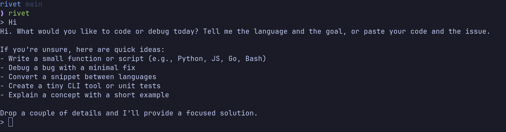

# Rivet
> A terminal-based coding agent written in Go.

 

## Status
Rivet is in early development. The project is currently focused on core
agent architecture and workflow primitives.

## Roadmap

### Core capabilities
- [ ] Multi-turn conversation
- [ ] Context management
  - [ ] Compaction/compression
  - [ ] Pruning
- [ ] Session management
- [ ] Checkpointing
- [ ] Loop detection
- [ ] Feedback loop

### Tooling
- [ ] Built-in tools
  - [ ] `read_file`
  - [ ] `write_file`
  - [ ] `edit_file`
  - [ ] `bash`
  - [ ] `web_fetch`
  - [ ] `web_search`
- [ ] Support for MCP
- [ ] Sub-agents
- [ ] Tool discovery

### Platform and configuration
- [ ] Hook support
- [ ] Approval policies
- [ ] System/project-level config
- [ ] Prompt engineering
